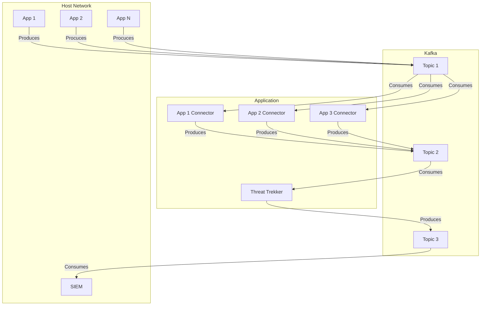

     ███████████ █████                               █████                   
    ░█░░░███░░░█░░███                               ░░███                    
    ░   ░███  ░  ░███████  ████████ ██████  ██████  ███████                  
        ░███     ░███░░███░░███░░█████░░███░░░░░███░░░███░                   
        ░███     ░███ ░███ ░███ ░░░███████  ███████  ░███                    
        ░███     ░███ ░███ ░███   ░███░░░  ███░░███  ░███ ███                
        █████    ████ ██████████  ░░██████░░████████ ░░█████                 
       ░░░░░    ░░░░ ░░░░░░░░░░    ░░░░░░  ░░░░░░░░   ░░░░░                  
                  ███████████               █████     █████                        
                 ░█░░░███░░░█              ░░███     ░░███                         
                 ░   ░███  ░████████ ██████ ░███ █████░███ █████  ██████  ████████ 
                     ░███  ░░███░░█████░░███░███░░███ ░███░░███  ███░░███░░███░░███
                     ░███   ░███ ░░░███████ ░██████░  ░██████░  ░███████  ░███ ░░░ 
                     ░███   ░███   ░███░░░  ░███░░███ ░███░░███ ░███░░░   ░███     
                     █████  █████  ░░██████ ████ █████████ █████░░██████  █████    
                    ░░░░░  ░░░░░    ░░░░░░ ░░░░ ░░░░░░░░░ ░░░░░  ░░░░░░  ░░░░░         

This repository gathers all the information about my master's thesis. This project, called `ThreatTrekker` is being
developed in collaboration with the UC3M university.

# Installation

See this [manual](./docs/instalation.md) for getting the virtual environment with all the dependencies.

## Documentation

* [Dataset Samples](./data/datasets/readme.md)
* [Useful links about possible datasets to include](resources/repos.md)

---

### How to run the script

1. Active the provided conda environment.
2. Run all the commands from the project root directory (ATTOW it is necessary due to the local imports within the
   project).
3. run python3 `main.py -h` in order to display the CLI help.

### Useful commands

* _Create a Dataframe from a dataset_

    ```bash
    python3 ./threat-hunting-ia/threat_trekker.py --build-dataset -i uwf-dataset/ -o $(date +%FT%H-%M-%S)-uwf.parquet
    ```
  > **&#9432;** The `$(date +%FT%H-%M-%S)`-uwf.parquet_ is just a fancy way of adding a timestamp to the output file.

* _Train an ML algorithm with the previously created dataframe_

    ```bash
    python3 ./threat-hunting-ia/threat_trekker.py -i uwf-dataset/parsed/2023-07-09T16-04-31-uwf.parquet  --sample 0.70
    ```
  > **&#9432;** Due to ram limitations sometime it is necessary to sample the dataset with the flag `--sample`.

---

### Aplication Flow

